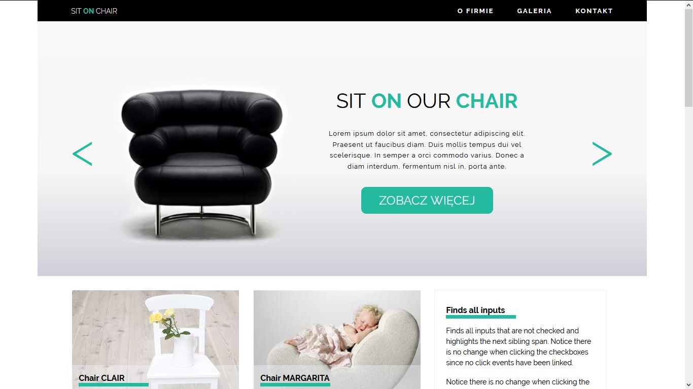
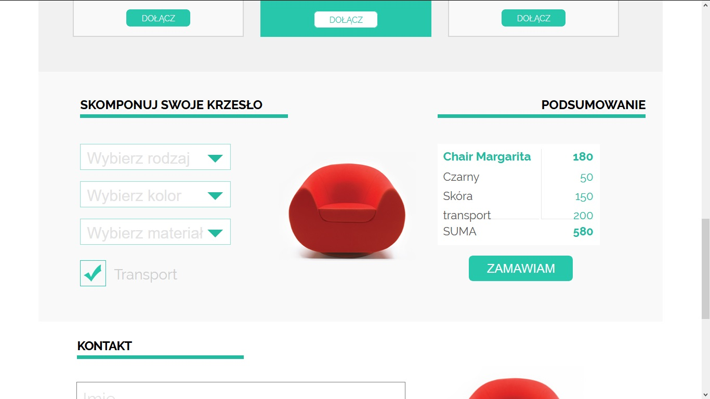

# SitOnChair webpage

Webpage written as part of CodersLab.pl workshop. The task was to 
pixel perfect recreate given jpeg file. Interactive functionality
is written in Javascript, including section which calculates the 
price of chair based on chosen features.  

Technology used: HTML5, CSS, Javascript.
